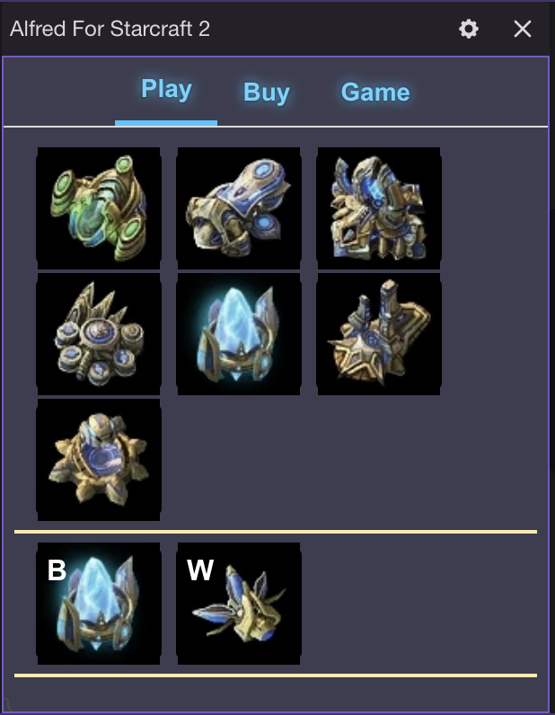

A Twitch extension for playing StarCraft 2 game with your viewers or your favorite streamers. Viewers do not even need to install the game or have a graphics heavy hardware. Viewers can command the StarCraft 2 game instance running on Streamer's channel through this Twitch extension.

## **Instructions for Streamers**

- First install the [Desktop App for Mac](https://www.somsite.com) for AlfredBot.
- Install and Launch the App and Login with your Twitch Account.
- Now click on the **Launch Game**. 
- It is important to launch the game instance before going live on Twitch, otherwise incoming commands from your viewers will be lost.
- Now click the **Start Game** button on Twitch extension Game tab. Take this action after a few minutes into the game to allow for sufficient minning so that your viewers can afford building different structures.
- In the game currently you can only play against the computer.
- Up to 5 players can join the game.
- You can select any one of the Nexus to receive incoming commands from your viewers.
- In case no Nexus is selected, the incoming commands from your viewers will be executed on any random Nexus.
- Remember to click on **Stop Game** from the Twitch extension to close a session.
- Just closing the game instance on your desktop, does not kills the session yet.

## **Instructions for Viewers**

- Login into the AlfredBot Twitch extension with your Twitch account.
- Buy any one of the command packages.
- Now you are eligible to join ongoing live StarCraft 2 game session on current channel.
- At this point you can check the mining stats of the game and wait for a few seconds before joining game to be able to afford building structures.
- Click the **Join Game** button in extension to join a game session.
- Up to 5 players can join the session, so if session is full then you can try later.
- It is not necessary to exhaust the command package in one session. You can play a few commands and leave and join later.
- You can also add more number of commands by purchasing more packages.
